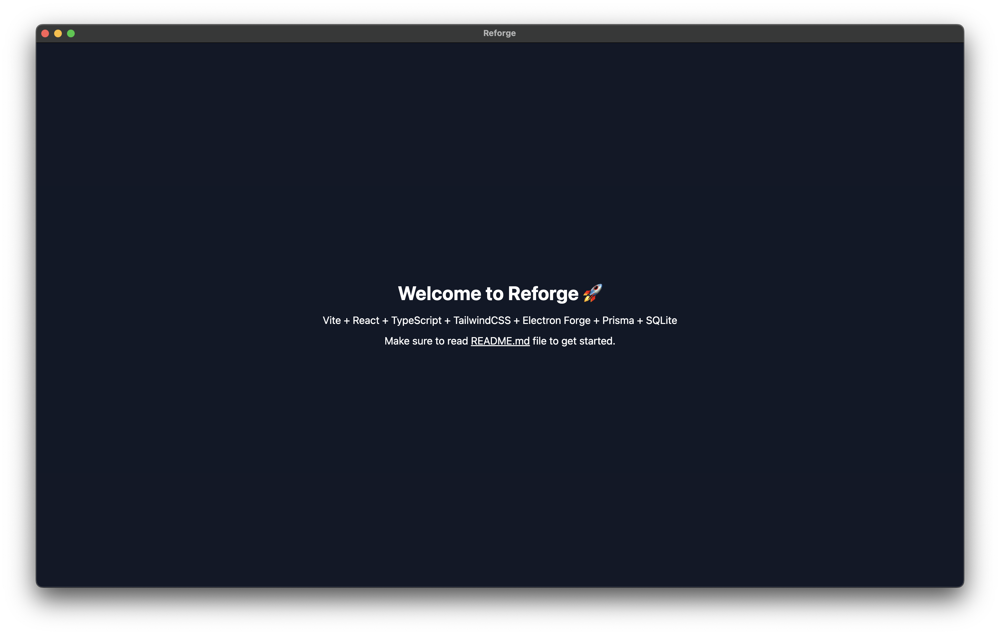

# Reforge

Reforge is a simple boilerplate for creating desktop applications that combines React, Vite, and Electron + Electron Forge. With some additionals like TypeScript, TailwindCSS, Prisma, Prettier, Husky, and Lint-Staged. To make this a standalone application, you can use preconfigured PrismaORM to work with SQLite database or you can change it to any other database you want (soon).



## Features

- **React** - A JavaScript library for building user interfaces.
- **Vite** - A build tool that aims to provide a faster and leaner development experience for modern web projects.
- **Electron** - A framework for creating native applications with web technologies like JavaScript, HTML, and CSS.
- **Electron Forge** - A complete tool for creating, publishing, and installing modern Electron applications.
- **TypeScript** - A strict syntactical superset of JavaScript that adds optional static typing.
- **TailwindCSS** - A utility-first CSS framework for rapidly building custom designs.
- **Prisma** - A modern database access toolkit designed specifically for TypeScript and Node.js.
- **Prettier** - An opinionated code formatter that enforces a consistent code style.
- **Husky** - A tool that makes it easy to use githooks as if they are npm scripts.
- **Lint-Staged** - A tool that runs linters on git staged files.
- **SQLite** - A C-language library that implements a small, fast, self-contained, high-reliability, full-featured, SQL database engine.

## Getting Started

1. Clone the repository:

```bash
git clone https://github.com/renatoka/reforge.git
```

2. Install the dependencies:

```bash
cd reforge
npm install
```

3. Run the application:

```bash
npm run start
```

## License

This project is licensed under the MIT License - see the [LICENSE](LICENSE) file for details.

```
## Contributing

Please read [CONTRIBUTING.md](CONTRIBUTING.md) for details on our code of conduct, and the process for submitting pull requests to us.

## Authors

- **renatoka** - [renatoka](https://github.com/renatoka)
```
